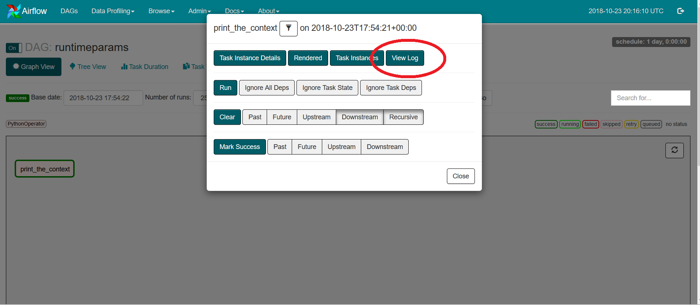
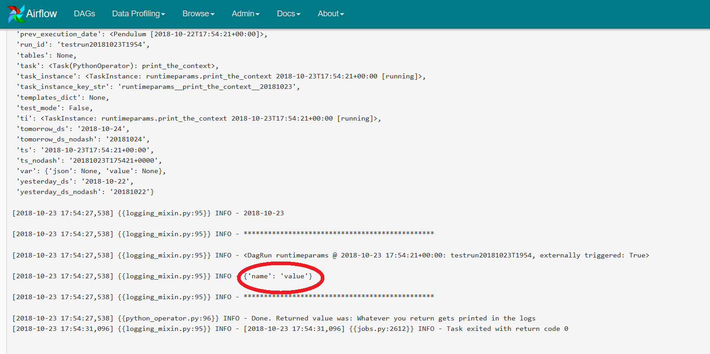

# docker-airflow

Dockerizált AirFlow (https://airflow.apache.org) image a https://github.com/puckel/docker-airflow alapján. Tesztelés céljából.

## Előfeltételek

Linux alatt nincs szükség Dockerizálásra...

A Docker image a következő környezetben lett legyártva / tesztelve:

* **Windows 10**  Pro (64 bites)
  * Virtualizálás engedélyezve
  * Hyper-V engedélyezve
  * VirtualBox nem volt előzőleg telepítve
* **Docker for Windows CE** (Version 18.06.1-ce-win73 (19507) stable https://store.docker.com/editions/community/docker-ce-desktop-windows) 
  * Linux contairekkel

További részletekhez ld. a következőt: [docker_install.md](doc/docker_install.md)

## Használat

Futtasd az alábbit adminként:

```shell
> docker run -p 8080:8080 csomgyula/docker-airflow
```

A fenti esetben az Airflow Webes konzol a 8080-as porton lesz elérhető, vagyis a következő címen: <http://localhost:8080>. Ha a 8080-as port nem szabad, vagy más okból nem szeretnéd, akkor pl. ezt futtasd

```
> docker run -p 9080:8080 csomgyula/docker-airflow
```

Ez esetben a <http://localhost:9080> porton lesz elérhető az admin.

Ezekután még be kell menni a konténerbe és el kell indítani a schedulert:

```shell
> docker ps -a
> docker exec -i -t [CONTAINER] bash
$ airflow scheduler
```

Az első, `docker ps -a` paranccsal tudod megnézni a konténer nevét, amit a következő  `docker exec`parancsban kell használnod, amikor bash terminált nyitsz a konténerbe. Miután bejutottál az `airflow scheduler` indítja (az előtérben) az időzítőt.

## Mire jó?

Az egyetlen, amit hozzátesz az eredeti Docker image-hez (https://github.com/puckel/docker-airflow) az a **runtime paraméter átadás** tesztelése a REST API-n (https://airflow.apache.org/api.html) keresztül:

* Példa DAG: [dags/runtimeparams.py](dags/runtimeparams.py) 
  * Ez valósítja meg a paraméter fogadást. Nem csinál mást mint kiírja...
  * A DAG scriptet a Docker image eleve tartalmazza, ld. `/usr/local/airflow/dags`)
* Teszt scriptek: 
  * [test/runtimeparams.curl](test/runtimeparams.curl) - Curl parancs, aminek futtatásához persze szükséged van a Curl (https://curl.haxx.se/) eszközre)
  * [test/runtimeparams.curl.json](test/runtimeparams.curl.json) - a JSON paramétereket tartalmazza. 

## Paraméter átadás tesztelése

A teszt eredménye egyébként az, hogy **lehet paramétert átadni a REST API-n keresztül** a `conf` paraméter segítségével, pl.:

```json
{
	"run_id": "testrun20181023T1954", 
	"conf": "{\"name\": \"value\"}" 
}
```

Megjegyzés:  A `conf` escape-elésére sajnos szükség van, mert az AirFlow Python script (közelebbről a `json.load`) sztringet vár. Ld. pl.: https://stackoverflow.com/questions/5997029/escape-double-quotes-for-json-in-python

**Teszt menete**:

1. Le kell futtatni a curl scriptben lévő parancsot a konzolon: `curl -X POST -H "Content-Type: application/json" -d 
   @runtimeparams.curl.json 
   http://localhost:8080/api/experimental/dags/runtimeparams/dag_runs` 
   1. A webszerver portját persze át kell állítani, ha nem a 8080-asra lőtted be.
   2. Amennyiben a `runtimeparams` DAG még nincs engedélyezve, akkor be kell kapcsolni a Webes admin konzolon. 
   3. Ha többször is futtatni akarod a tesztet, akkor a JSON fájlban ([test/runtimeparams.curl.json](test/runtimeparams.curl.json)) módosítanod kell a `run_id`-t. Ez ugyanis egyedi kell, legyen.
2. A paraméter átadást ezután az AirFlow logban tudod ellenőrizni: DAGs -> runtimeparams -> Graph view  -> print_the_context -> View log





## További irodalom a REST API-ról

https://airflow.apache.org/api.html (rövid leírás)

https://github.com/apache/incubator-airflow/blob/master/tests/www/api/experimental/test_endpoints.py (unit tesztek)

https://github.com/apache/incubator-airflow/blob/master/airflow/www/api/experimental/endpoints.py (implementáció)

